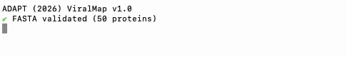

# ViralMap

Multi-label annotation of eukaryotic viral protein sequences.



## Contents
- [Overview](#overview)
- [Version](#version)
- [Installation](#installation)
- [Inputs](#Inputs)
- [Usage](#usage)
- [Outputs](#outputs)
- [Citation](#citation)
- [Authors](#authors)
- [Contact](#contact)

## Version
v1.0

## Overview

ViralMap annotates viral protein sequences across 10 residue-level classes in three categories:

- **Topology & Localization:** Signal peptide, transmembrane, cytoplasmic, extracellular
- **Post-translational Modifications:** N-glycosylation, furin cleavage, chain cleavage, disulfide bond
- **Structural Features:** Coiled coil, disordered region

[Model weights](https://huggingface.co/shrishdwivedi/vmap) are downloaded automatically from HuggingFace on first run and cached locally. The paper [dataset](https://huggingface.co/shrishdwivedi/vmap-dataset) is available at HuggingFace.

## Installation

### Prerequisites / Requirements
- Python >= 3.11, < 3.13
- ~20 GB RAM with ~20GB disk space for caching model weights
- CUDA-capable GPU **strongly** recommended. CPU is supported but significantly slower.

### 1. Install PyTorch
Install PyTorch with CUDA support **before** installing ViralMap. Visit [pytorch.org](https://pytorch.org/get-started/locally/) for the right command for your system. Example for CUDA 12.1:
```bash
pip install torch --index-url https://download.pytorch.org/whl/cu121
```

### 2. Install ViralMap
```bash
git clone https://github.com/HMRI-ADAPT/vmap.git
cd vmap
pip install .
```

### 3. Verify
```bash
vmap -h
```

## Inputs

ViralMap accepts a standard FASTA file with protein sequences. Headers should be **short, unique** identifiers (used to name output files). Sequences must be protein, not nucleotide.

```
>P0DTC2
MFVFLVLLPLVSSQCVNLTTRTQLPPAYTN...
>Q9QNP2
MEKLLCFLVTLSGAQDSAGNHCNFNITTEV...
```

- One header + sequence per entry
- Headers should be concise (e.g., UniProt accession) — they become output filenames
- Sequences must contain only standard amino acid characters
- No explicit length limit, but for best results, use for proteins $\leq$ 1,024 residues 

## Usage

```bash
vmap -id <run_id> -i <input.fasta> [options]
```

### Arguments

| Argument | Description |
|----------|-------------|
| `-id`, `--run_id` | Unique identifier for this run (names the output directory) **(required)** |
| `-i`, `--input` | Path to input FASTA file **(required)** |
| `-m`, `--mode` | Enable sensitive mode: stronger sensitivity for topology & localization and structural features (only use in edge cases otherwise run predictions without this flag) |
| `-w`, `--weights` | Path to local model weights directory. If not provided, downloads from HuggingFace |
| `-o`, `--output_dir` | Directory where output will be created (default: current directory) |

### Examples

Basic inference:
```bash
vmap -id my_run -i test.fasta
```

Using local weights:
```bash
vmap -id my_run -i test.fasta -w /path/to/weights/
```

## Outputs

For each input fasta, two types of outputs are provided for each protein in addition to one overview summary file. All ouputs are written to `<output_dir>/<run_id>_vmap_out/`.

```
my_run_vmap_out/
├── summary.csv                    # one row per protein, all features summarized (one per FASTA)
├── P0DTC2_vmap_preds.csv          # per-residue predictions for each protein (one per protein)
├── P0DTC2_viz.html                # interactive visualization (one per protein)
```

### (1) Summary (.csv)
One row per protein with predicted regions/positions and counts for each feature. Each number is a residue position. Comma separated numbers represent individual residue annotations. Comma separated residue positions bounded by brackets represent start/end residues for that annotation. Note that for chain cleavage sites, it is possible to have both individual residue annotation, in which case cleavage occurs between that residue and the next, and bracketed residue annotations, where cleavage is predicted to occur between those residues. Most likely if a chain cleavage site prediction is bracketed, it is a furin cleavage site and will also be captured by the furin cleavage site prediction.

| Entry | Signal Peptide | Signal Peptide (count) | N-Glycosylation | N-Glycosylation (count) | ... |
|-------|---------------|----------------------|-----------------|------------------------|-----|
| P0DTC2 | [1,13] | 1 | 17, 61, 74, 122, ... | 21 | ... |

### (2) Per-protein residue-level predictions (.csv)

Each `*_vmap_preds.csv` contains one row per residue with probability scores and binary predictions:

| Column | Description |
|--------|-------------|
| `Residue` | Residue index (1-indexed) |
| `AA` | Amino acid |
| `SP_prob`, `TM_prob`, ... | Per-class sigmoid probabilities |
| `SP`, `TM`, `CY`, `EX`, `CC`, `DR` | Binary predictions from HMM decoding |
| `NG`, `FR`, `CH`, `DB` | Binary predictions from threshold |

### (3) Per-protein interactive visualizations (.html)

Each protein gets an interactive Plotly visualization with per-feature annotation tracks, hover-to-inspect residue probabilities, and a summary table. Opens in any browser.

## Citation

```bibtex
@article{dwivedi2026viralmap,
  title={ViralMap: Predicting Features in Viral Proteins from Primary Sequence},
  author={Dwivedi, Shrish and Kar, Shaunak and Horton, Andrew P. and Gollihar, Jimmy D.},
  year={2026},
  doi={10.64898/2026.04.07.716565}
}
```

## Authors

Shrish Dwivedi  
Shaunak Kar, PhD  
Andrew P. Horton PhD  
Jimmy D. Gollihar PhD

Houston Methodist Research Institute — ADAPT Lab

## Contact
For any questions, please reach out to:  
Shrish Dwivedi — sd168@rice.edu | sdwivedi@houstonmethodist.org